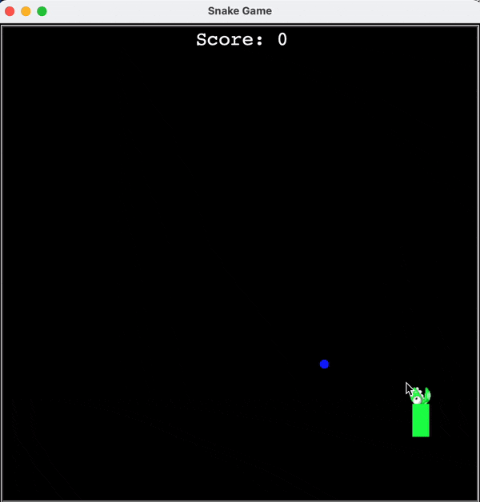
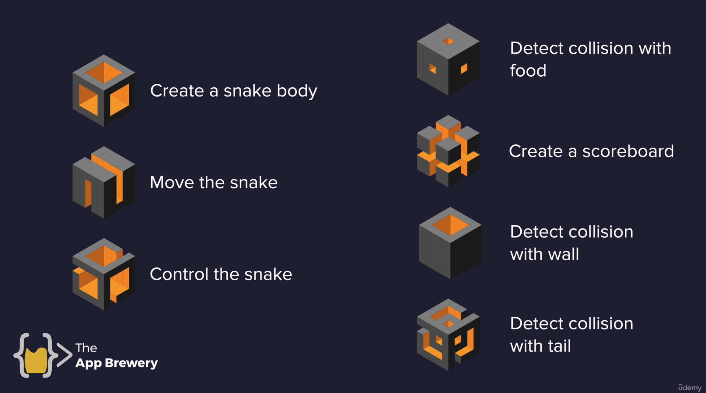
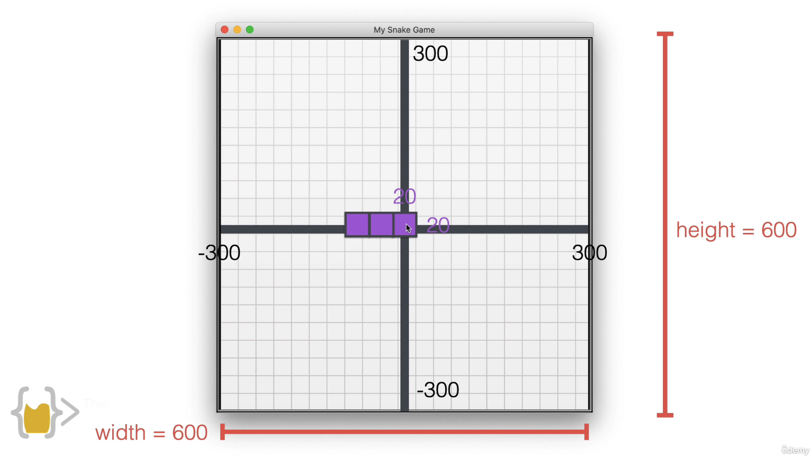
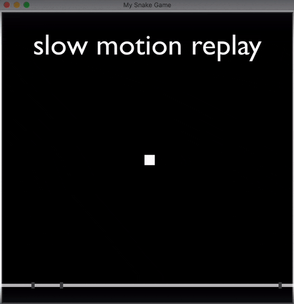
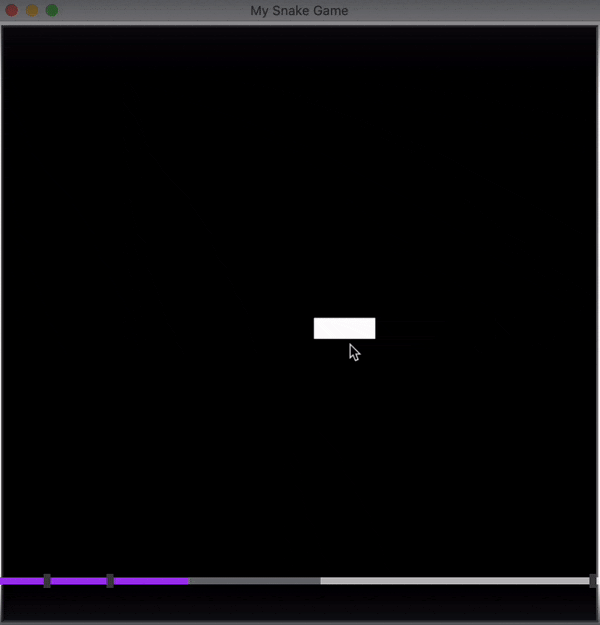
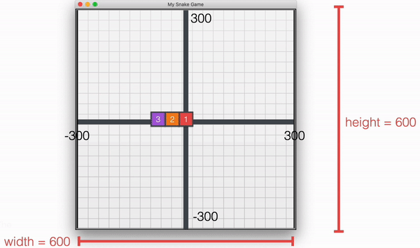
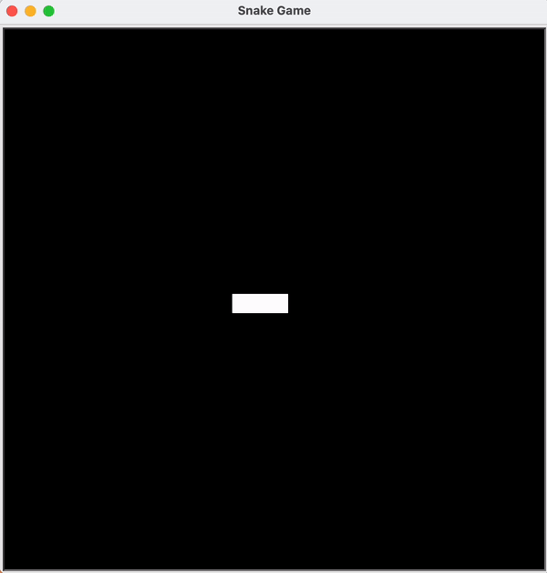
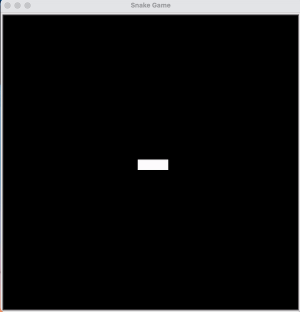
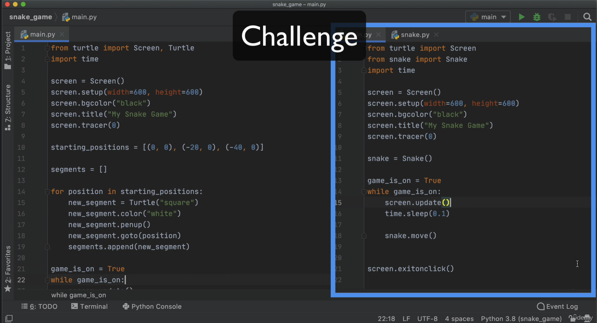
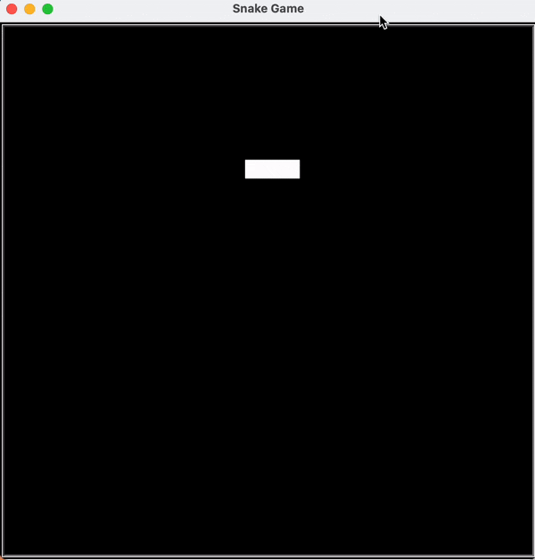

This is a project to create a Snake Game.

This is how the game looks like:


Below we have the step-by-step guide from the Udemy 100 Days of Code - The Complete Python Pro Bootcamp, with Angela Yu as the instructor.


# Table of Contents
<!-- TOC -->
* [Task 1: Create Snake Body](#task-1-create-snake-body)
* [Task 2: Move the Snake](#task-2-move-the-snake)
  * [How to move as a whole?](#how-to-move-as-a-whole)
  * [How to turn the snake?](#how-to-turn-the-snake)
* [Task 3: Control the snake](#task-3-control-the-snake)
<!-- TOC -->

# Task 1: Create Snake Body


```commandline
from turtle import Screen, Turtle
import time

screen = Screen()
screen.setup(width=600, height=600)
screen.bgcolor("black")
screen.title("Snake Game")

# Task 1: Create a snake body
starting_positions = [(0, 0), (-20, 0), (-40, 0)]

segments = []
for position in starting_positions:
    new_segment = Turtle("square")
    new_segment.color("white")

    new_segment.penup()
    new_segment.goto(position)

    segments.append(new_segment)

screen.exitonclick()
```

# Task 2: Move the Snake

Simplest way is to loop through the segment and make each of them move forward
```commandline
...

# Task 2: Move the snake
game_is_on = True
while game_is_on:
    for seg in segments:
        seg.forward(20)

...
```

## How to move as a whole?

Above code sees the segments move forward but they are not attached together.

To see what is actually going on, we can **turn off the animation** and **update screen after each segment move**. 
To enable us to see what is actually going on, we add a **time gap 1 sec** in between each segment move.
```commandline
screen.tracer(0)

# Task 2: Move the snake
game_is_on = True
while game_is_on:
    for seg in segments:
        seg.forward(20)
        
        screen.update()
        time.sleep(1)
```


Now we want to **update screen after all 3 segments move**
```commandline
screen.tracer(0)

# Task 2: Move the snake
game_is_on = True
while game_is_on:
    screen.update()
    time.sleep(1)
    
    for seg in segments:
        seg.forward(20)

```


Now we can see they move as a whole. Change `time.sleep(1)` to `time.sleep(0.1)` will make it move faster.

## How to turn the snake?
- Move the 3rd segment to the place of the 2nd segment
- Move the 2nd segment to the place of the 1st segment
- Move the 1st segment as we want it to go



Implemented in code:
```commandline
    # move the 3rd segment to the place of the 2nd segment
    # move the 2nd segment to the place of the 1st segment
    for seg_num in range(len(segments)-1, 0, -1):
    
        # find the x,y of the in-front segment
        new_x = segments[seg_num - 1].xcor()
        new_y = segments[seg_num - 1].ycor()
        
        # place the current segment to there
        segments[seg_num].goto(new_x, new_y)

```

Note that:
- In the first loop, 3rd replaced 2nd position, 2nd replaced 1st position. So 3 segments became 2;
- In the second loop, 2nd replaced 1st position. So 2 segments became 1;
- Loop ends



We need to add this line to make the first one move
- In the first loop, 3rd replaced 2nd position, 2nd replaced 1st position, 1st moves as we directed. 3 segments keep length.
- In the second loop, repeat above
- Repeat while the game is on

```commandline
    ...
    # move the 1st segment as we want it to go
        segments[0].forward(20)
    ...
```



Now we can use the first segment `segments[0]` to control the direction of the snake move.


# Task 3: Control the snake
Before we go further, we created a Snake Class and moved the existing code to OOP.


Next step, we added key bindings to screen:
In `main.py`:
```commandline
...
screen.listen()
screen.onkey(snake.up, "Up")
screen.onkey(snake.down, "Down")
screen.onkey(snake.left, "Left")
screen.onkey(snake.right, "Right")
...
```

In `snake.py`, create the functions:
```commandline

UP = 90
DOWN = 270
LEFT = 180
RIGHT = 0

    def up(self):
        self.head.setheading(UP)

    def down(self):
        self.head.setheading(DOWN)

    def left(self):
        self.head.setheading(LEFT)

    def right(self):
        self.head.setheading(RIGHT)
```

Also noticing that in the Snake game, the snake cannot move down when it is heading up, similarly cannot move to the right when it is heading to the left
Thus we added a conditional check below:
```commandline
    def up(self):
        if int(self.head.heading()) != DOWN:
            self.head.setheading(UP)

    def down(self):
        if int(self.head.heading()) != UP:
            self.head.setheading(DOWN)

    def left(self):
        if int(self.head.heading()) != RIGHT:
            self.head.setheading(LEFT)

    def right(self):
        if int(self.head.heading()) != LEFT:
            self.head.setheading(RIGHT)
```
Here we can use UP, DOWN, LEFT and RIGHT keys to control how the snake moves.



# Task 4: Detect collision with food

Create a `Food` class:
```commandline
from turtle import Turtle
import random


class Food(Turtle):

    def __init__(self):
        super().__init__()
        self.shape("circle")
        self.penup()
        self.shapesize(0.5, 0.5)
        self.color("blue")
        # So we don't need to look at the animation of the food being created
        self.speed("fastest")

        self.refresh()

    def refresh(self):
        random_x = random.randint(-13, 13) * 20
        random_y = random.randint(-13, 13) * 20
        self.goto(random_x, random_y)
```

When collision happens, the food goes to another random place:
```commandline
game_is_on = True
while game_is_on:
    ...

    # Detect collision with food
    if snake.head.distance(food) < 15:
        print("Collision!")
        food.refresh()
```

# Task 5: Create a scoreboard

Create a `Scoreboard` class:
```commandline
from turtle import Turtle

SCORE_BOARD_POSITION = (0, 270)
ALIGNMENT = "center"
FONT = ('Courier', 24, 'normal')


class Scoreboard(Turtle):

    def __init__(self):
        super().__init__()

        self.score = 0

        self.color("white")
        self.hideturtle()
        self.penup()
        self.goto(SCORE_BOARD_POSITION)

        self.update_scoreboard()

    def update_scoreboard(self):
        self.write(arg=f"Score: {self.score}", align=ALIGNMENT, font=FONT)

    def increase_score(self):
        self.score += 1

        self.clear()
        self.update_scoreboard()
```

When detecting collision with food, increase score:
```commandline
game_is_on = True
while game_is_on:
    ...

    # Detect collision with food
    if snake.head.distance(food) < 15:
        ...
        scoreboard.increase_score()
```

# Task 6: Detect collision with wall

In `Scoreboard` class, write a new function `game_over()` to pop up the "Game Over" message when the condition is triggered:
```commandline
    def game_over(self):
        self.goto(CENTRE)
        self.write(arg="Game Over.", align=ALIGNMENT, font=FONT)
```

When detecting the snake hit the wall, trigger the `game_over()` function:
```commandline
game_is_on = True
while game_is_on:
    ...
    # Detect collision with wall
    if abs(snake.head.xcor()) > 280 or abs(snake.head.ycor()) > 280:
        game_is_on = False

if not game_is_on:
    scoreboard.game_over()
```

# Task 7: Detect collision with tail

# Task 7.1: Extend the Snake after eating a food

In `Snake` class, add a new function `extend()`:
```commandline
    def add_segment(self, position):
        new_segment = Turtle("square")
        new_segment.color("white")

        new_segment.penup()
        new_segment.goto(position)

        self.segments.append(new_segment)

    def extend(self):
        # Add this segment to the same position as the last segment
        self.add_segment(self.segments[-1].position())
```

After collision with food, call the `extend()` function:
```commandline
game_is_on = True
while game_is_on:
    ...

    # Detect collision with food
    if snake.head.distance(food) < 15:
        ...
        snake.extend()
        ...
```

# Task 7.2: Detect collision with tail

If detecting colliding with tail, call `game_over()`:

```commandline
game_is_on = True
while game_is_on:
    ...
    # Detect collision with tail
    # If head collides with any segment other than the head itself
    for segment in snake.segments[1:]:
        if snake.head.distance(segment) < 10:
            game_is_on = False

if not game_is_on:
    scoreboard.game_over()
```

Congrats! This completes the game building.